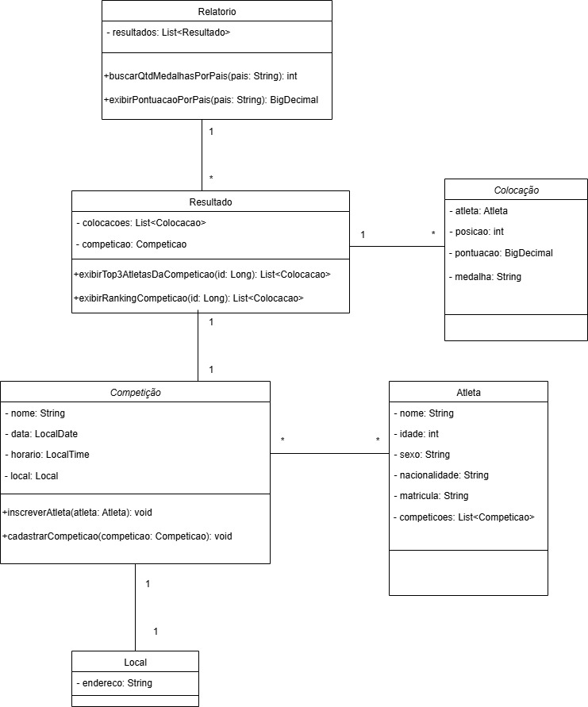

# sistema-gestao-olimpiadas

Este é um projeto para a disciplina de Projeto de Software da PUC Minas. O objetivo é criar um Sistema de Gestão das Olimpíadas (SGO) para coordenar os diferentes aspectos do evento, permitindo o gerenciamento de competições, inscrições de atletas, alocação de locais para as provas e controle de resultados.

## Histórias de Usuário

Abaixo estão as histórias de usuário do sistema, baseadas nas regras de negócio:

* **(US01)** Eu, como Coordenador, quero cadastrar uma nova competição (com modalidade, data, horário e local) para que os atletas possam se inscrever.
* **(US02)** Eu, como Atleta, quero me inscrever em uma ou mais competições para participar do evento.
* **(US03)** Eu, como Coordenador, quero garantir que um atleta represente apenas um país por modalidade, para manter a integridade da competição.
* **(US04)** Eu, como Coordenador, quero alocar locais para as competições, garantindo que não haja conflitos de horário (um local só pode abrigar uma competição por vez).
* **(US05)** Eu, como Juiz/Coordenador, quero registrar os resultados de uma competição, identificando o primeiro, segundo e terceiro lugar.
* **(US06)** Eu, como Coordenador/Imprensa, quero gerar um relatório de medalhas (ouro, prata, bronze) por país para acompanhar o desempenho geral.

## Diagramas UML

Abaixo estão os diagramas UML desenvolvidos para o sistema, conforme solicitado.

### Diagrama de Caso de Uso

### Diagrama de Classes

### Diagrama de Pacotes

### Diagrama de Componentes

### Diagrama de Implantação
